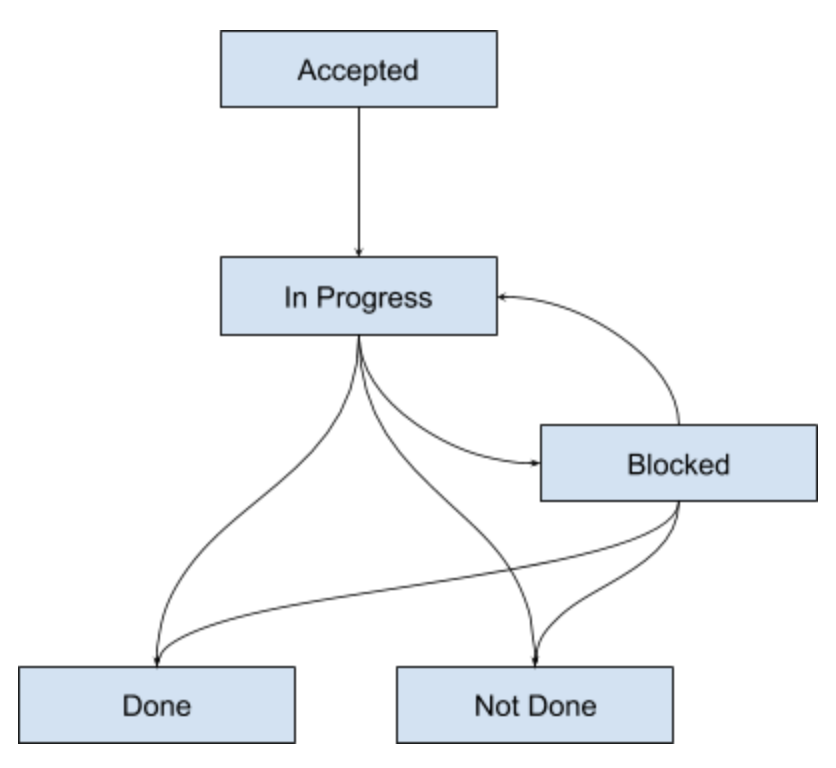
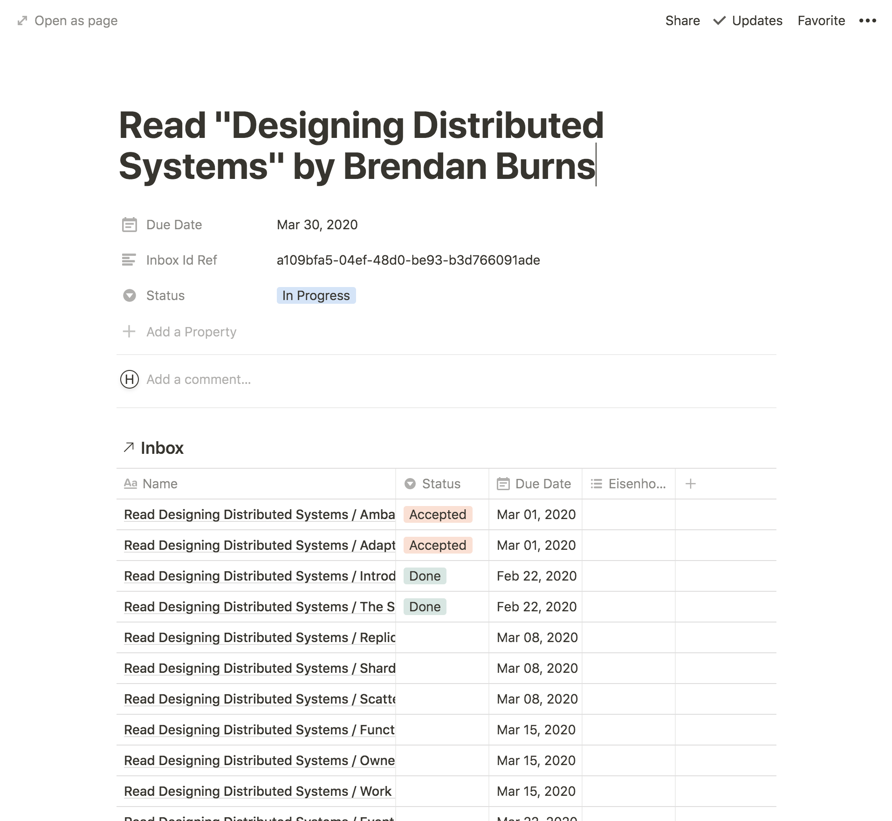

# Big Plans

Big plans are larger units of work. They are made up of multiple tasks. Big plans
live in the "Big Plan page". A big plan is ideal to model work which can be done
in anything from a week to several months, and which consists of multiple steps.

For example, you can have a task like "Plan a family vacation", or "Get a talk
accepted to a conference", or "Buy a new house".

Big plans have a _status_, which can be one of:

* _Accepted_: all big plans you create should start with this status. It means you're
  going to start working on this plan in the near to medium future.
* _In Progress_: all big plans you're currently working on should be placed in this
  status. Once you start working on some tasks from the plan, it can be counted as being
  in progress.
* _Blocked_: all big plans that you're currently not able to push through for some reason.
  Either all tasks are blocked, or you can't start on any new ones, etc. It can move back
  and forth to "In Progress", and then to "Not Done" or "Done".
* _Done_: the big plan is finished, with the desired outcome.
* _Not Done_: the big plan is finished, but not with the desired outcome.
* _Archived_: the big plan has been archived, currently just a manual operation.
* _No Status_: some big plans don't have a status for various reasons.

In the big plan page, you can see big plans in a sort of Kanban board, organised by status
like this:

The state evolution diagram is:

You can create a big plan via regular Notion mechanisms (pressing the various "New"
buttons). You can remove a big plan by simply removing the Notion record of it.

In order for things to properly work out however, you also need to run
`jupiter sync`. This makes sure that the big plans are setup correctly, and
that the various Notion pages know about the new or removed big plan. It is an idempotent
operation, useful to use in case of updates too.

Big plans have an actionable date, much like _inbox tasks_. Conceptually, this is the the
time from which you can start working on a particular big plan.

Big plans also have a deadline. It's optional, but it's strongly recommended you add one
as a goal setting rule.

Any tasks that don't have their own actionable or due dates will inherit them from the big
plan, if it has any.

Between them, the actionable and due dates allow you to schedule the big plans in time in
a more organized manner. There is a special view which allows for this.

In Notion a big plan might look like this:

Notice there is a link to the project's Inbox for the tasks associated with that plan. You
can view the completion status here.

You can create a task for the big plan directly here, or you can create one in the Inbox
and link it via the `Big Plan` property.

## Big Plans Page

The big plan page is a representation of your current and longer term work. It's a
collection of big plans. They are created here in the "Accepted" state.

The big plan page looks like a Kanban board, with the various states of a big plan as
columns.

It also has a useful _timeline_ view, which is a Gnatt chart of sorts.

