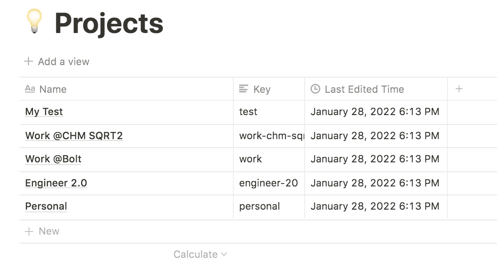

# Projects

The workspace contains _one or more_ _projects_. If the workspace is where all the
work happens, a project is where some part of the work happens. Usually some
coherent subset of it.

For example, you can have a project for your personal goal tracking, and one for
your career goal tracking etc. In most cases just one or two projects are enough,
and they should be very long lived things.

Projects are created via the `jupiter project-create $projectKey --name "Project Name"`
command.

`jupiter project-create` is idempotent, and is a good way to update projects as
newer versions of the tool appear.

After creating a project, you’ll see something like the following in the Notion
left hand bar - here with two Jupiter created pages (“Inbox” and “Big Plan”) and one
regular Notion page (“Blog Ideas”):

## Projects Properties

On their own, projects have a single property - their name.

## Projects Interactions Summary

You can:

* Create a project via `project-create`.
* Remote a project via `project-remove`.
* Synchronise changes between the local store and Notion via `vacations-sync`.
* See a summary of the workspace via `vacations-show`.
